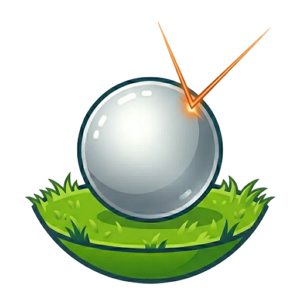
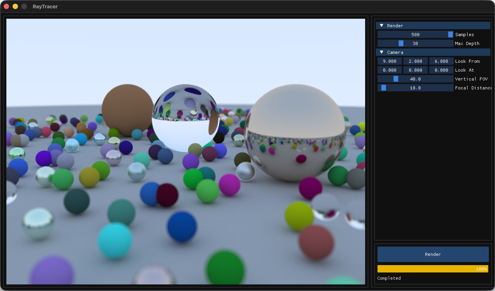

<!-- Source: https://github.com/othneildrew/Best-README-Template/ -->
<a id="readme-top"></a>
<!-- PROJECT LOGO -->
<br />
<div align="center">
  <a href="https://github.com/DiegoGomesDG/RayPlayground">
    
  </a>

<h3 align="center">Ray Playground</h3>

  <p align="center">
    An interactive software raytracer written in C++, with a graphical user interface made using ImGUI & OpenGL.
    <br />
    <a href="https://github.com/DiegoGomesDG/RayPlayground/issues/new?labels=bug&template=bug-report---.md">Report Bug</a>
    &middot;
    <a href="https://github.com/DiegoGomesDG/RayPlayground/issues/new?labels=enhancement&template=feature-request---.md">Request Feature</a>
  </p>
</div>

<!-- TABLE OF CONTENTS -->
<details>
  <summary>Table of Contents</summary>
  <ol>
    <li> <a href="#-about-the-project">About The Project</a> </li>
    <li> <a href="#-features">Features</a> </li>
    <li>
      <a href="#-getting-started">Getting Started</a>
      <ul>
        <li><a href="#-prerequisites">Prerequisites</a></li>
        <li><a href="#-installation">Installation</a></li>
      </ul>
    </li>
    <li><a href="#-usage">Usage</a></li>
    <li><a href="#-roadmap--future-ideas">Roadmap / Future Ideas</a></li>
    <li><a href="#-acknowledgments">Acknowledgments</a></li>
    <li><a href="#-license">License</a></li>
  </ol>
</details>


<!-- ABOUT THE PROJECT -->
## 🎯️ About The Project
<p align="center">
  
</p>

This project is an interactive ray tracing application written in C++, inspired by the book series [Ray Tracing in One Weekend](https://raytracing.github.io/). It serves as a hands-on exploration of physically based rendering (PBR), light transport, and realistic image synthesis.

The motivation behind this project comes from my studies in computer graphics, which led me to independently explore rendering techniques beyond the university curriculum. The goal is not only to understand how images are generated, but also how physical phenomena such as light interaction and material behavior can be simulated computationally. At the same time, the project serves as a practical framework for exploring and applying fundamental mathematical concepts such as probability, linear algebra, and trigonometry, which are essential to modern rendering algorithms.

In addition, this project is designed as a modular and extensible application, allowing continuous development and experimentation with new rendering techniques, optimizations, and features over time.

## 🚀 Features
- Interactive Rendering Controls
    - Adjust rendering parameters in real time (samples, depth, etc.)
    - Modify camera properties such as position and vertical field of view (FoV)
- Camera System
    - Fully configurable camera (position, direction, FoV)
- Rendering Feedback
    - Progress bar for current render
    - Estimated remaining render time

<!-- GETTING STARTED -->
## 📦 Getting Started

### 📋 Prerequisites
* CMake 3.20 or higher
* C++20 compatible compiler
* OpenGL 3.3

> Note: This project is currently developed for macOS, using OpenGL 3.3 for better compatibility (as newer OpenGL versions are deprecated on macOS).

### ⚙️ Installation (CMake)

1. Clone the repository (with submodules)
   ```sh
   git clone --recurse-submodules https://github.com/DiegoGomesDG/RayPlayground
   cd RayPlayground
   ```
2. Create and enter the build directory
   ```bash
    mkdir build
    cd build
   ```
3. Configure and build
   ``` bash
    cmake ..
    cmake --build .
   ```
4. Run the application
   ``` bash
   cd RayTracing
   ./RayTracing
   ```


<!-- USAGE EXAMPLES -->
## 🛠️ Usage
The application is designed to be straightforward to use
- Click **Render** to start rendering the scene
- Adjust parameters using the UI sliders:
  - Samples per pixel
  - Ray bounce depth
  - Camera position and FoV

Currently, scene objects are static and cannot yet be modified through the UI.

## 💡Roadmap / Future Ideas
- Scene editor
  - Add, remove, and modify objects dynamically from the UI
- Real-time rendering mode
  - (Partially implemented, requires improved thread management)
- GPU acceleration through Metal (macOS) and CUDA
- Continue implementation of advanced techniques from:
  - _Ray Tracing: The Next Week_
  - _Ray Tracing: The Rest of Your Life_
- Support for mesh loading
- Physics-based simulations

## 🙏 Acknowledgments
- [Ray Tracing in One Weekend](https://raytracing.github.io/)
- [The Cherno](https://www.youtube.com/@TheCherno)
  - [Ray Tracing Series](https://www.youtube.com/playlist?list=PLlrATfBNZ98edc5GshdBtREv5asFW3yXl) - initial inspiration for developing a GUI-based ray tracing application
  - [Architecture Series](https://www.youtube.com/playlist?list=PLlrATfBNZ98cpX2LuxLnLyLEmfD2FPpRA) - guidance on structuring a modular and scalable application
  - [Wallnut](https://github.com/StudioCherno/Walnut) - framework used as a reference for application architecture

<!-- LICENSE -->
## 📄 License
Distributed under the MIT License. See `LICENSE.txt` for more information.


